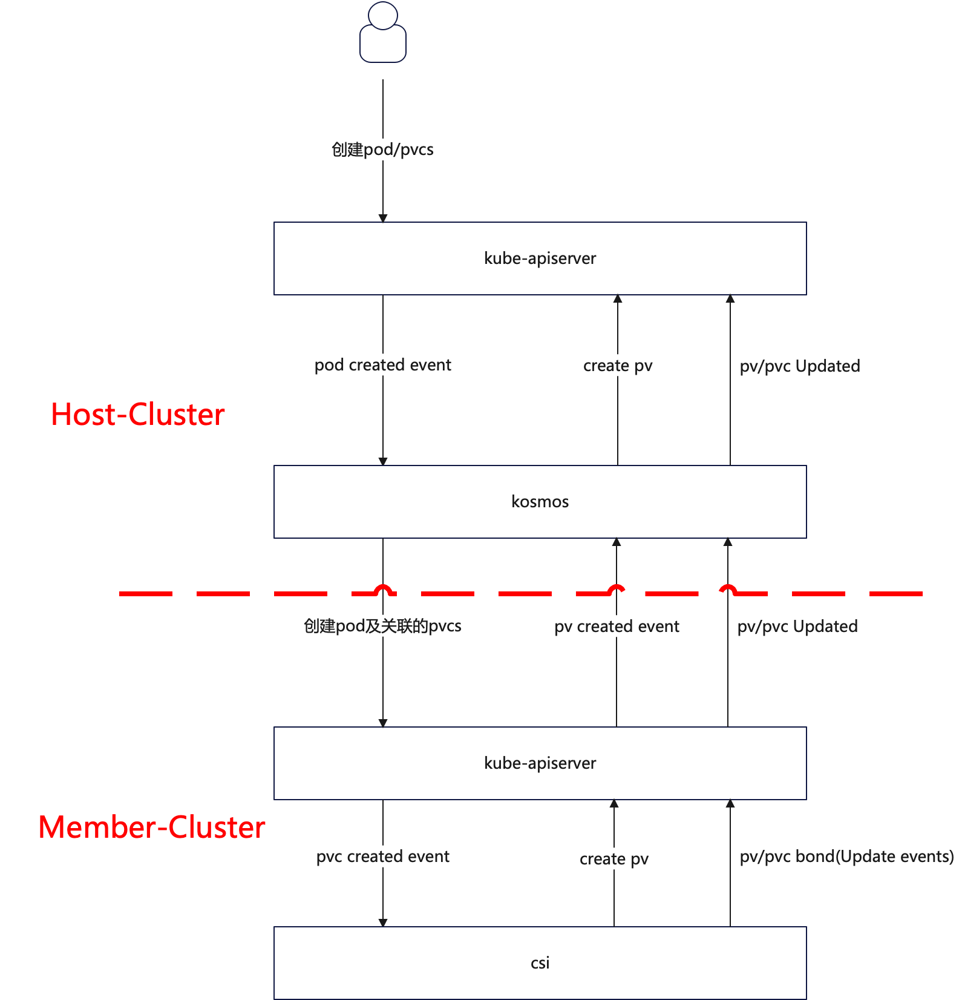

# 多集群 PV/PVC 动态存储解决方案

## 多集群 PV/PVC 动态存储实现

### 介绍
本文主要介绍在 Kosmos 跨集群中，为有状态服务相关的 Pod 实现 PV/PVC 存储管理。
详细说明了创建、更新和绑定 Pod 的 PV 和 PVC 的过程。
通过本文，您可以全面了解在 Kosmos 中管理有状态服务的细节。

:::info 提示
目前的实现是一个中间版本，未来会对全球存储进行进一步优化。
:::

### 方法

#### 单个 Kubernetes 集群中 PVC、PV 和 SC 的角色
1. 持久卷 (Persistent Volume, PV):
- PV 是 Kubernetes 集群中的存储卷资源，将其与实际的存储后端抽象和分离开来。
- PV 可以是任何形式的存储，如网络存储、本地存储、云存储等。
- PV 可以由 PV 管理员或集群中的动态存储插件预先创建，也可以根据 PVC 的要求动态创建。
- PV 描述了存储属性，如容量、访问模式（例如，读/写）和回收策略。

2. 持久卷声明 (Persistent Volume Claim, PVC):
- PVC 是应用程序对存储资源的请求，它在 Pod 中指定所需的存储容量和其他属性，如访问模式和卷模式。
- 应用程序使用 PVC 声明其存储需求，而无需指定实际的存储位置或类型。Kubernetes 会根据 PVC 的需求匹配集群中的可用 PV 以满足 PVC 的需求。
- PVC 可以请求动态配置的匹配 PV 或手动选择特定的 PV 对象。

3. 存储类 (StorageClass, SC):
- SC 定义了 PV 的动态配置策略，指定了如何根据 PVC 的需求自动创建 PV。
- 当 PVC 请求特定的 StorageClass 时，Kubernetes 会根据 StorageClass 中定义的规则创建 PV 并自动将 PV 绑定到 PVC。
- StorageClass 允许定义不同类型的存储，为不同的应用程序提供不同的存储选项。

#### 单个 Kubernetes 集群中 PVC、PV 和 StorageClass 的实现过程
- 当应用程序中的 Pod 需要访问持久存储时，会创建一个 PVC 对象来声明所需的存储。
- 根据 PVC 中定义的需求，Kubernetes 会通过 StorageClass 匹配适合的 PV 并进行绑定。
- 在 PV 和 PVC 成功绑定后，应用程序可以直接使用 PVC 提供的存储并在 Pod 中挂载存储路径。

#### StorageClass 卷绑定模式
在 StorageClass 定义中，'volumeBindingMode' 字段指定了动态配置器如何绑定 PVC 和 PV。以下是几种常见的卷绑定模式：
- Immediate: 在这种模式下，配置器会立即将可用的 PV 绑定到 PVC。如果没有可用的 PV 满足 PVC 的要求，PVC 将保持在 Pending 状态。
- WaitForFirstConsumer: 在这种模式下，配置器会等待引用 PVC 的 Pod 尝试挂载卷后再分配 PV。当 Pod 使用 PVC 时，PV 会被动态绑定。
- Cluster: 这是默认的绑定模式。PV 会立即分配给 PVC。这种模式类似于 'Immediate'，但允许集群管理员覆盖 StorageClass 的默认绑定模式。
每个 StorageClass 只能有一种绑定模式，并且一旦设置后不能更改。

根据需求和环境配置选择适当得绑定模式。

#### CSI（动态卷配置）相关过程
1. 用户创建一个 Pod 和 PVC。
2. VolumeController 的 PersistentVolumeController 控制循环检测到 PVC 的创建并跳过它，因为它使用的是 Out-of-Tree 模式。
该控制循环主要处理 In-Tree 模式下的 PV 和 PVC 绑定。
3. External-provisioner 检测到 PVC 的创建：
- 调用 Controller Service 的 'CreateVolume' 方法创建底层存储卷。此时，卷处于 CREATED 状态，仅在存储系统中存在，对任何节点或容器不可见。
- 创建 PV。
- 将 PV 绑定到 PVC（绑定：在 PVC 对象的 spec.volumeName 字段中填写该 PV 对象的名称）。
4. VolumeController 的 AttachDetachController 控制循环检测到卷未附加到主机，需要执行 Attach 操作。它创建 'VolumeAttachment' 对象。
5. 当 external-attacher 检测到 'VolumeAttachment' 资源的创建时，它调用 Controller Service 的 'ControllerPublishVolume' 方法。
此时，卷处于 NODE_READY 状态，意味着节点可以检测到卷，但在容器内部仍不可见。
6. Kubelet 的 VolumeManagerReconciler 控制循环：
- 调用 Node Service 的 'NodeStageVolume' 方法执行 MountDevice 操作。该方法主要处理格式化卷并将其挂载到临时目录（Staging 目录）。
此操作后，卷进入 VOL_READY 状态。
- 调用 Node Service 的 'NodePublishVolume' 方法执行 SetUp 操作。
- 它绑定 Staging 目录并将其挂载到卷的相应主机目录。
- 卷进入 PUBLISHED 状态，用户现在可以正常使用它。

#### 跨集群实现
基于单个 Kubernetes 集群中 PVC、PV 和 StorageClass 的逻辑，并结合 Kosmos 中跨集群创建 Pod 实例的逻辑，跨集群实现 PV/PVC 的方法如下：
- 在主集群（Host-Cluster）中，StorageClass 的 volumeBindingMode 设置为 WaitForFirstConsumer，确保延迟绑定和配置 PV（等待与成员集群同步）直到创建使用 PersistentVolumeClaim 的 Pod。
PersistentVolumes 将根据 Pod 中指定的调度约束（包括资源要求、节点选择器、Pod 亲和性和反亲和性、污点和容忍度）进行选择或配置。
- 主集群（Host-Cluster）中的 PVC 和 PV 绑定应与 Kosmos 中跨集群创建 Pod 的过程一致。
- 主集群（Host-Cluster）中的 PV 控制器仅处理 PV 删除事件，创建和更新操作由成员集群中的 PV 控制器执行。

### 流程
Kosmos PV/PVC 的实现流程如下：



- 当在主集群（Host-Cluster）中创建 Pod 并有相关的 PVC 请求时，Kosmos 将根据 Pod 创建事件在成员集群中创建相应的 PVC。
- 在成员集群（Member-Cluster）中创建 PVC 后，流程与单个 Kubernetes 集群中的流程相同，包括 Pod 创建、PVC 创建、PV 创建和 PVC-PV 绑定的完成。
- 当在成员集群（Member-Cluster）中创建 PV 时，相应的 PV 控制器将根据 PV 创建事件在主集群（Host-Cluster）中创建 PV。
- 在成员集群（Member-Cluster）中成功调度并绑定 PVC 和 PV 后，主集群（Host-Cluster）中的 PV 创建将完成 PVC 和 PV 的绑定。

### 相关

#### 调度模块（主集群）
此模块可以通过扩展 Kosmos 调度器中的 VolumeBinding 插件实现。可以通过使用带有 "kosmos.io/node=true:NoSchedule" 污点的虚拟节点来实现。

#### 编排模块
此模块的实现主要基于第 3 节中描述的步骤，包括 Kosmos 集群管理器中的 root_pod_controller.go、root_pvc_controller.go、leaf_pvc_controller.go、root_pv_controller.go 和 leaf_pv_controller.go。

### 示例
1. YAML 示例:
````shell script
apiVersion: v1
kind: PersistentVolumeClaim
metadata:
  name: nginx-pvc
  namespace: test-new
spec:
  accessModes:
  - ReadWriteOnce
  resources:
    requests:
      storage: 1Gi
  storageClassName: openebs-hostpath
---
apiVersion: apps/v1
kind: Deployment
metadata:
  name: nginx-new
  namespace: test-new
spec:
  selector:
    matchLabels:
      app: nginx
  replicas: 1
  template:
    metadata:
      labels:
        app: nginx
      deletionGracePeriodSeconds: 30
    spec:
      affinity:
        nodeAffinity:
          requiredDuringSchedulingIgnoredDuringExecution:
            nodeSelectorTerms:
              - matchExpressions:
                  - key: kubernetes.io/hostname
                    operator: In
                    values:
                      - kosmos-cluster38
      tolerations:
      - key: "kosmos.io/node"
        operator: "Equal"
        value: "true"
        effect: "NoSchedule"
      containers:
      - name: nginx
        image: registry.paas/cnp/nginx:1.14-alpine
        ports:
        - containerPort: 80
        volumeMounts:
        - name: data
          mountPath: /data
      volumes:
      - name: data
        persistentVolumeClaim:
          claimName: "nginx-pvc"
````

2. 在主集群中执行创建操作:
````shell script
[root@kosmos-control-cluster ylc]# kubectl apply -f test.yaml
persistentvolumeclaim/nginx-pvc created
deployment.apps/nginx-new

 created
[root@kosmos-control-cluster ylc]# kubectl get all -n test-new
NAME                             READY   STATUS    RESTARTS   AGE
pod/nginx-new-5677468b6c-ns9k2   0/1     Pending   0          5s

NAME                        READY   UP-TO-DATE   AVAILABLE   AGE
deployment.apps/nginx-new   0/1     1            0           5s

NAME                                   DESIRED   CURRENT   READY   AGE
replicaset.apps/nginx-new-5677468b6c   1         1         0       5s
[root@kosmos-control-cluster ylc]# kubectl get all -n test-new -owide
NAME                             READY   STATUS    RESTARTS   AGE   IP              NODE               NOMINATED NODE   READINESS GATES
pod/nginx-new-5677468b6c-ns9k2   1/1     Running   0          11s   10.*.*.252   kosmos-cluster38   <none>           <none>

NAME                        READY   UP-TO-DATE   AVAILABLE   AGE   CONTAINERS   IMAGES                                SELECTOR
deployment.apps/nginx-new   1/1     1            1           11s   nginx        nginx:1.14-alpine   app=nginx

NAME                                   DESIRED   CURRENT   READY   AGE   CONTAINERS   IMAGES                                SELECTOR
replicaset.apps/nginx-new-5677468b6c   1         1         1       11s   nginx        nginx:1.14-alpine   app=nginx,pod-template-hash=56774
[root@kosmos-control-cluster ylc]# kubectl get pvc -n test-new
NAME        STATUS   VOLUME                                     CAPACITY   ACCESS MODES   STORAGECLASS       AGE
nginx-pvc   Bound    pvc-ad86ef86-23c1-407e-a8e7-0b3e44d36254   1Gi        RWO            openebs-hostpath   21s
````

3. 查询成员集群中的状态:
````shell script
[root@cluster38 ~]# kubectl get all -n test-new
NAME                             READY   STATUS    RESTARTS   AGE
pod/nginx-new-5677468b6c-ns9k2   1/1     Running   0          2m36s
[root@cluster38 ~]# kubectl get pvc -n test-new
NAME        STATUS   VOLUME                                     CAPACITY   ACCESS MODES   STORAGECLASS       AGE
nginx-pvc   Bound    pvc-ad86ef86-23c1-407e-a8e7-0b3e44d36254   1Gi        RWO            openebs-hostpath   2m41s
````

### 结论
Kosmos 中 PV/PVC 的动态存储实现需要扩展以支持全球存储。目前的实现粒度较小，仍需进一步改进和演进。