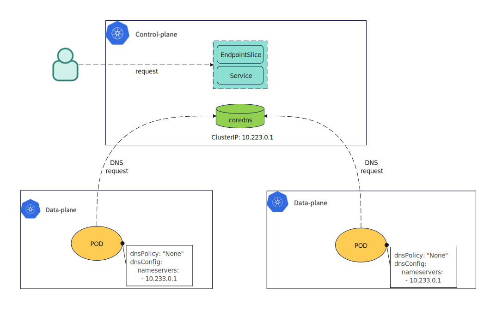

# Multi-cluster Service Discovery
Kosmos provides two capabilities for multi-cluster service discovery:
- Distributed multi-cluster service solution 
- Global centralized core-dns solution. Among them, in production environments, we recommend the decentralized distributed multi-cluster service solution.

## Distributed Multi-Cluster Service Solution

### Introduction
Kosmos implements multi-cluster service discovery based on the Multi-Cluster Service API. Users can export services generated by the control plane cluster to member clusters, thereby providing services externally in member clusters.

:::info NOTE
To use this feature, ensure that the control plane cluster and member clusters have a version of at least v1.21, and the version of core-dns in the cluster is not less than v1.84.
:::

The architecture of Kosmos' distributed multi-cluster service solution is as follows.


Kosmos' controller monitors the ServiceExport and ServiceImport resources of the control plane and data plane, and synchronizes the Service and EndpointSlice from the control plane to the data plane cluster based on the configuration of these two MCS resources. In any data plane cluster, services can be exposed externally through Service, and each data plane cluster's EndpointSlice will contain all Pod IPs of the workloads in the control plane cluster, achieving cross-cluster multi-active services across different locations.

### Prerequisites

#### Install Kosmos
Refer to the Kosmos Quick Start documentation https://github.com/kosmos-io/kosmos and enable the ClusterLink module for multi-cluster networking. Using the kosmosctl tool:
````shell script
kosmosctl install --cni calico --default-nic eth0 (We build a network tunnel based on the network interface value passed by the arg default-nic)
````

#### Join the Leaf Cluster
````shell script
kosmosctl join cluster --name cluster1 --kubeconfig ~/kubeconfig/cluster1-kubeconfig --cni calico --default-nic eth0 --enable-link
````

### Using Distributed Multi-Cluster Service

#### Manual Exporting and Importing of Service
Users can manually create ServiceExport and ServiceImport to distribute services to data plane clusters.

1. Create a nginx workload in the data plane cluster, the nginx yaml is as follows:
````shell script
apiVersion: apps/v1
kind: Deployment
metadata:
  name: nginx
spec:
  replicas: 2
  selector:
    matchLabels:
      app: nginx
  template:
    metadata:
      labels:
        app: nginx
    spec:
      tolerations:
        - key: "kosmos.io/node"
          operator: "Equal"
          value: "true"
          effect: "NoSchedule"
        podAntiAffinity:
          requiredDuringSchedulingIgnoredDuringExecution:
            - labelSelector:
                matchLabels:
                  app: nginx
              topologyKey: kubernetes.io/hostname
      containers:
        - name: nginx
          image: nginx:latest
          ports:
            - containerPort: 80
---
apiVersion: v1
kind: Service
metadata:
  name: nginx
spec:
  selector:
    app: nginx
  ports:
    - protocol: TCP
      port: 80
      targetPort: 80
      nodePort: 31444
  type: NodePort
````
:::info NOTE
The workload's pods can be scheduled to Kosmos' leaf nodes by specifying node affinity in the yaml.
:::

2. Create a ServiceExport in the control plane to export the nginx Service:
````shell script
apiVersion: multicluster.x-k8s.io/v1alpha1
kind: ServiceExport
metadata:
  name: nginx
````

3. Create a ServiceImport in data plane cluster 1 to import the exported Service:
````shell script
apiVersion: multicluster.x-k8s.io/v1alpha1
kind: ServiceImport
metadata:
  name: nginx
spec:
  type: ClusterSetIP
  ports:
    - protocol: TCP
      port: 80
````
At this point, the service can be exposed externally in data plane cluster 1 using the same Service.

### Automatic Exporting and Importing of Service to all Data Plane Clusters
In some scenarios, users need to automatically synchronize the control plane's Service to all data plane clusters without manually creating ServiceExport and ServiceImport. Kosmos provides two methods for automatic export and import of Service.

#### Annotation-based Recognition via Control Plane Service
For services that need to be automatically exported and distributed to all data plane clusters, users can manually add an annotation to the Service: `kosmos.io/auto-create-mcs: "true"`. An example service yaml is as follows:
````shell script
apiVersion: v1
kind: Service
metadata:
  name: nginx
  annotations:
    kosmos.io/auto-create-mcs: "true"
spec:
  selector:
    app: nginx
  ports:
    - protocol: TCP
      port: 80
      targetPort: 80
      nodePort: 31444
  type: NodePort
````

#### Global Startup Parameters
For cases where code modification is not desired, Kosmos also supports automatic distribution of services by configuring startup parameters. Add the parameter `--auto-mcs-prefix` to the ClusterTree startup service, for example, configuring `--auto-mcs-prefix=test`, kosmos will automatically export services under namespaces with the test and kosmos prefixes to all data plane clusters.

### Service Cross-Cluster Network Connectivity Verification
`eps-probe-plugin` is a plugin for cross-cluster service network verification. As mentioned above, Kosmos' controller synchronizes the Service and EndpointSlice from the control cluster to the data plane cluster. When there is a network connectivity failure across clusters, the endpoints in the EndpointSlice become unreachable, leading to malfunction.

`eps-probe-plugin` checks whether the pod-ips in the endpoint are reachable on a regular basis. It updates the addresses of unreachable endpoints to `"kosmos.io/disconnected-address"` in serviceImport. The Kosmos controller will remove the unreachable endpoints from the exported Service's corresponding EndpointSlice.

`eps-probe-plugin` can be installed using the following command:
````shell script
kubectl apply -f https://raw.githubusercontent.com/kosmos-io/eps-probe-plugin/main/deploy/eps-probe-plugin.yaml
````

## Global Centralized Core-DNS Solution

### Introduction
The global centralized core-dns solution is shown in the diagram below. All pods distributed through Kosmos are resolved through the core-dns of the control plane cluster. This approach is only suitable for testing environments and may cause excessive request load on the core-dns of the control plane cluster in production environments.

To enable the global centralized core-dns solution, simply modify the startup parameter of the clusterTree service to `--multi-cluster-service=false`.

