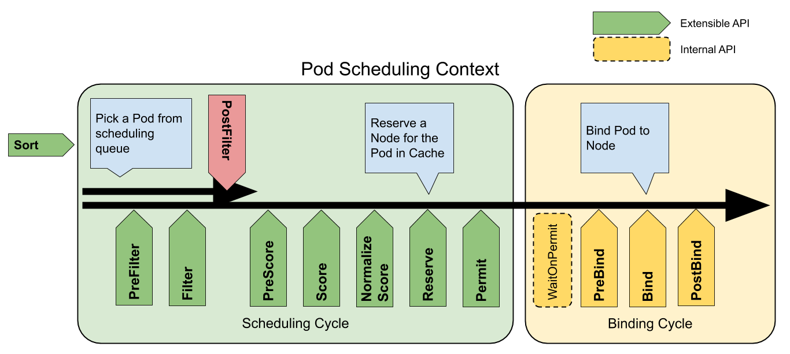

#  Multi-cluster Scheduler

After Kosmos join a member cluster, it will map a virtual node with the `kosmos.io/node=true:Noschedule` taint, so the Kubernetes default scheduler cannot schedule Pods to the virtual node (i.e, the member cluster). 
After deploying the kosmos-scheduler, users can tolerate the `kosmos.io/node=true:Noschedule` taint through the `LeafNodeTaintToleration` scheduling plugin in kosmos-scheduler to achieve an indiscriminate mixed scheduling effect between member cluster and host cluster nodes. 

For Pods with PV/PVC, you also need to configure the `LeafNodeVolumeBinding` scheduling plugin in kosmos-scheduler to directly use the virtual node with the `kosmos.io/node=true:Noschedule` taint during the storage volume binding process.

It should be noted that for different versions of Kubernetes, the scheduling module (Scheduler Framework) on which the published default scheduler depends will also change with the version. Currently, Kosmos has also adapted to the two versions (`release-1.21.5` and `release-1.26.3`). 
The following verification part will be deployed and tested with release-1.21.5.

##  Multi-cluster Scheduler Solution

### Introduction
The Scheduler framework was first introduced through the [624-scheduling-framework](https://link.zhihu.com/?target=https%3A//github.com/kubernetes/enhancements/tree/master/keps/sig-scheduling/624-scheduling-framework) proposal of kubernetes enhancements, mainly to achieve the following goals:
- Make scheduler more extendable.
- Make scheduler core simpler by moving some of its features to plugins.
- Propose extension points in the framework.
- Propose a mechanism to receive plugin results and continue or abort based on the received results.
- Propose a mechanism to handle errors and communicate them with plugins.

For this purpose, the scheduler framework defines multiple extension points as follows:


The **LeafNodeTaintToleration** and **LeafNodeVolumeBinding** scheduling plugins in kosmos-scheduler are mainly optimized based on the ***NodeTaintToleration*** and ***NodeVolumeBinding*** scheduling plugins of the Kubernetes default scheduler. The **LeafNodeTaintToleration** plugin mainly adds tolerance to the **「kosmos.io/node=true:Noschedule」** taint in the virtual node in the **Filter extension point**. The **LeafNodeVolumeBinding** plugin mainly acts on the **Filter, Reserve, Unreserve, and PreBind extension points**, and directly passes the virtual node with the **「kosmos.io/node=true:Noschedule」** taint.

### Prerequisites

#### Install Kosmos
Refer to the Kosmos Quick Start documentation https://github.com/kosmos-io/kosmos and enable the ClusterLink module for multi-cluster networking. Using the kosmosctl tool:
````shell script
kosmosctl install --cni calico --default-nic eth0 (We build a network tunnel based on the network interface value passed by the arg default-nic)
````
:::info NOTE
At least the clustertree module is deployed and join the leaf cluster correctly.
:::

#### Join the Leaf Cluster
````shell script
kosmosctl join cluster --name cluster1 --kubeconfig ~/kubeconfig/cluster1-kubeconfig --cni calico --default-nic eth0 --enable-link
````

### Deploy Kosmos-scheduler
1. Configure scheduler and scheduling policy:
````shell script
---
# kosmos-scheduler scheduling policy
apiVersion: v1
kind: ConfigMap
metadata:
  name: scheduler-config
  namespace: kosmos-system
data:
  scheduler-config.yaml: |
    apiVersion: kubescheduler.config.k8s.io/v1beta1
    kind: KubeSchedulerConfiguration
    leaderElection:
      leaderElect: true
      resourceName: kosmos-scheduler
      resourceNamespace: kosmos-system
    profiles:
      - schedulerName: kosmos-scheduler
        plugins:
          preFilter:
            disabled:
              - name: "VolumeBinding"
            enabled:
              - name: "LeafNodeVolumeBinding"
          filter:
            disabled:
              - name: "VolumeBinding"
              - name: "TaintToleration"
            enabled:
              - name: "LeafNodeTaintToleration"
              - name: "LeafNodeVolumeBinding"
          score:
            disabled:
              - name: "VolumeBinding"
          reserve:
            disabled:
              - name: "VolumeBinding"
            enabled:
              - name: "LeafNodeVolumeBinding"
          preBind:
            disabled:
              - name: "VolumeBinding"
            enabled:
              - name: "LeafNodeVolumeBinding"
        pluginConfig:
          - name: LeafNodeVolumeBinding
            args:
              bindTimeoutSeconds: 5
---
# scheduler config
apiVersion: apps/v1
kind: Deployment
metadata:
  name: kosmos-scheduler
  namespace: kosmos-system
  labels:
    component: scheduler
spec:
  replicas: 1
  selector:
    matchLabels:
      component: scheduler
  template:
    metadata:
      labels:
        component: scheduler
    spec:
      volumes:
        - name: scheduler-config
          configMap:
            name: scheduler-config
            defaultMode: 420
      containers:
        - name: kosmos-scheduler
          image: ghcr.io/kosmos-io/scheduler:0.0.2
          command:
            - scheduler
            - --config=/etc/kubernetes/kube-scheduler/scheduler-config.yaml
          resources:
            requests:
              cpu: 200m
          volumeMounts:
            - name: scheduler-config
              readOnly: true
              mountPath: /etc/kubernetes/kube-scheduler
          livenessProbe:
            httpGet:
              path: /healthz
              port: 10259
              scheme: HTTPS
            initialDelaySeconds: 15
            periodSeconds: 10
            failureThreshold: 3
          readinessProbe:
            httpGet:
              path: /healthz
              port: 10259
              scheme: HTTPS
      restartPolicy: Always
      dnsPolicy: ClusterFirst
      serviceAccountName: kosmos-scheduler
      serviceAccount: kosmos-scheduler
````

2. Verify the kosmos-scheduler service: 
````shell script
# kosmos-scheduler is created.
kubectl -n kosmos-system get pod
NAME                                         READY   STATUS    RESTARTS   AGE
kosmos-scheduler-8f96d87d7-ssxrx             1/1     Running   0          24s
````

#### Try a Sample
1. Deploy openebs on the test cluster

2. Use case yaml（mysql-cluster.yaml）
````shell script
apiVersion: v1
kind: Secret
metadata:
  namespace: test-mysql
  name: my-secret
type: Opaque
data:
  # root password is required to be specified
  ROOT_PASSWORD: ${your_password}
  ## application credentials that will be created at cluster bootstrap
  # DATABASE:
  # USER:
  # PASSWORD:
---
kind: MysqlCluster
metadata:
  name: test-mysql-cluster
  namespace: test-mysql
spec:
  replicas: 2
  secretName: my-secret
  image: docker.io/percona:5.7
  mysqlVersion: "5.7"
  podSpec:
    affinity:         
      podAntiAffinity:
        requiredDuringSchedulingIgnoredDuringExecution:
        - labelSelector:
            matchLabels:
              mysql.presslabs.org/cluster: test-mysql-cluster
          topologyKey: kubernetes.io/hostname
  volumeSpec:
    persistentVolumeClaim:
      storageClassName: openebs-hostpath
      accessModes:
        - ReadWriteOnce
      resources:
        requests:
          storage: 1Gi
````

3. Operation instructions
````shell script
# List all nodes in the host cluster
kubectl get node
NAME                       STATUS     ROLES                       AGE   VERSION
kosmoscluster1-1           Ready      control-plane,master,node   21d   v1.21.5-eki.0
kosmoscluster1-2           Ready      node                        21d   v1.21.5-eki.0
kosmos-member2-cluster-1   Ready      agent                       24m   v1.21.5-eki.0
kosmos-member2-cluster-2   Ready      agent                       24m   v1.21.5-eki.0
 
# Show the taint information on the virtual node
kubectl describe node kosmos-member2-cluster-1  |grep Tai
Taints:             node.kubernetes.io/unreachable:NoExecute
 
kubectl describe node kosmos-member2-cluster-2  |grep Tai
Taints:             node.kubernetes.io/unreachable:NoExecute
 
# Scheduling by the kosmos-scheduler (hybrid scheduling)
kubectl apply -f  mysql-cluster.yaml
    
# Show instances (hybrid) scheduling result in host cluster
kubectl get pod -owide -n test-mysql
NAME                            READY   STATUS    RESTARTS   AGE   IP               NODE                       NOMINATED NODE   READINESS GATES
test-mysql-cluster-mysql-0      4/4     Running   0          3m    2409:xxxxx:8ac   kosmoscluster1-2           <none>           <none>
test-mysql-cluster-mysql-1      4/4     Running   0          2m    2409:xxxxx:8ae   kosmos-member2-cluster-1   <none>           <none>

# Show instances (hybrid) scheduling result in member cluster
kubectl get pod -owide -n test-mysql
NAME                            READY   STATUS    RESTARTS   AGE   IP               NODE                       NOMINATED NODE   READINESS GATES
test-mysql-cluster-mysql-1      4/4     Running   0          2m    2409:xxxxx:8ae   kosmos-member2-cluster-1   <none>           <none>
````

### Conclusion
You can see that kosmos-scheduler successfully schedules the Pods of the user instances to the host cluster and member clusters.

